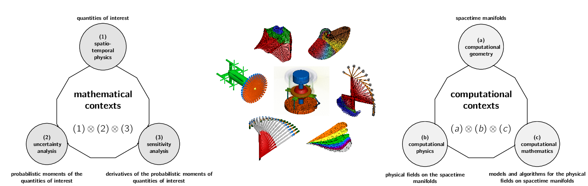

# Komahan Boopathy

| Research | External Links |
|---|---|
| [Context](#research-span) | [Google Scholar](https://scholar.google.com/citations?hl=en&user=YLg4R3sAAAAJ) |
| [Contributions](ResearchContributions.md) | [ORCID](https://orcid.org/0000-0002-2543-0942) |
| [Publications](SummaryOfPublications.md) | [Github](https://github.com/komahanb) |
| [Posters](RESEARCH_POSTERS.md) | [YouTube](https://www.youtube.com/@komahanboopathy) |
| [Projects](COMPUTATIONAL_PROJECTS.md) | [ResearchGate](https://www.researchgate.net/profile/Komahan-Boopathy) |
|  |  |

I am a research engineer at ANSYS working on the Fluent GPU solver development. My passion lies in crafting computational frameworks that analyze the static and dynamic equilibrium of aerospace designs and their environmental surroundings.

A computational physics simulations technology empowers the makers of aerospace systems to analyze how their design prototypes would perform beforehand, by doing repeated high-volume calculations -- distributed for efficiency -- across a larger network of inter-connected computer-hardware platforms, powered by electrical energy.
Such computational simulations are a viable cost-effective alternative to the more-expensive and time-consuming laboratory experiments commonly performed with a limited set of design parameters.
These simulations backed by the mathematical fabric of differential and algebraic equations, provide the ability to predict the performance of design prototypes on a much larger set of design parameters, and foster design innovations or quicker design turnarounds.
Motivated by such exciting prospects:

- the U.S. Department of Energy owns four of the top ten fastest supercomputers in the world [[1]](https://www.energy.gov/science/high-performance-computing), capable of high-volume number crunching of upto 1 quintillion operations per second
- the NASA is pursuing its 2030 vision for computatational methods aiming to improve the state-of-the-art of accuracy, speed, scalability and design optimization capabilities, in additional to the basic computational physics [[Mavriplis 2014]](/assets/publications/nasa-cfd-2030.pdf).

In line with these motivations of practical interest, and my excitement about the sheer amount of **Freedom** offered by the domain of computational mathematics for scientific research:

- The first channel of my work relates to the advancement of mathematical analysis pertinent to different physics such as the fluid-mechanics and solid-mechanics.
- The second channel of my work entails the hierarchical structuring (i.e. architecture) and implementation of the mathematical models and algorithms in a form amenable for high-performance computing.
- The third channel of my work concerns the application of these computational analysis capabilities in the context of aerospace design and optimization.

The years of my graduate education and research are focussed on the domain of computational sciences in aerospace engineering; where I apply the subject areas of mathematics and computing in the ultimate context of design-optimization of aerospace systems and sub-systems. 

| Degree | Program | School | Year | Thesis | Slides
|---|---|---|---|---|---|
| Ph.D | Aerospace Engineering | Georgia Institute of Technology | 2015 -- 2020 | [Adjoint Based Design Optimization of Systems with Time Dependent Physics and Probabilistically Modeled Uncertainties](http://hdl.handle.net/1853/63658) | [Slides](/assets/publications/komahan-boopathy-phd-defense.pdf)
| M.S  | Aerospace Engineering | University of Dayton | 2012 -- 2014 | [Uncertainty Quantification and Optimization Under Uncertainty Using Surrogate Models](http://rave.ohiolink.edu/etdc/view?acc_num=dayton1398302731) | [Slides](/assets/publications/komahan-boopathy-masters-defense.pdf)
| B.Tech | Aerospace Engineering | SRM University | 2008 -- 2012 | -- | -- |
| | | | | | |

The core methods forming the computational mathematics layer are fairly generic to other fields of engineering and computational sciences (e.g. computational biology, computational finance); thanks to [R. Descartes' (1596–1650)](https://plato.stanford.edu/entries/descartes/) admirable philosophical insights into the abstract nature of mathematics. I hope to find time to explore other such interesting applications.

## Research Context and Span 

I conduct research within the domain spanned by *Philosophy*  *Mathematics*  *Physics*  *Computing*.
This is a multidisciplinary field that is synthesis of a fair bit of numerical mathematics, computer programming, and the mechanics of matter in fluid and solid forms.
My long-term vision is creation of autonomous and scalable computational multi-physics analysis and design frameworks by synthesizing techniques from the following subject areas:

| Area | Purpose |
|---|---|
Flexible Multibody Dynamics and Computational Fluid Mechanics | laws concerning the behavior of solids and fluids under forces |
Uncertainty Quantification and Statistical Inference | theory to incorporate statistics into deterministic computational methods |
Design Optimization Under Uncertainty | field of optimization that is foundational to accommodate randomness for improving design robustness and reliability |
Adjoint and Tangent Sensitivity Analysis | scalable methods for obtaining analytical derivatives for design optimization |
Multi-Fidelity Surrogate Modelling | theoretical concepts for cost-effective approximations concerning data interpolation or regression and the augmentation of higher-order information |
Software Architecture and High Performance Computing | organization of computational modules and handling their complex interactions among themselves and the computer hardware|
Blockchain and Artificial Intelligence | hosts the implementation of computational algorithms, handle inter-node communications, on- and off-chain data storage, and achieve automation |
| |