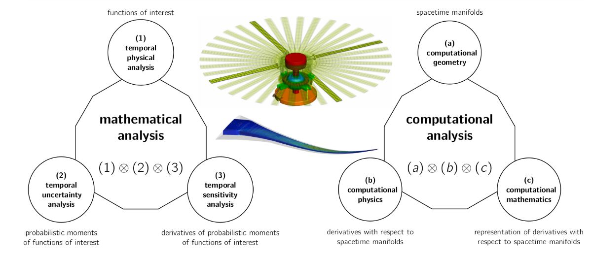

## RESEARCH CONTRIBUTIONS

### Computational Aerosciences

#### Computational Methods for Physics Informed Aerospace Design Optimization Under Uncertainties 



Computational aerosciences is a special field of study under Aerospace Engineering which spearheads the aerospace sector into next generation by fostering research and development of modern civilian and military aerospace technologies at an accelerated pace. The field is of direct interest to the U.S. (as well as foreign) research agencies such as the [Airforce Research Laboratory](https://afresearchlab.com/technology/aerospace/), [NASA](https://sourcelink.cadence.com/CFD-2030-Fact-Sheet-2022-final.pdf), [Oak Ridge National Laboratory](https://www.ornl.gov/division/csed), [Sandia National Laboratory](https://www.sandia.gov/ccr/), [Argonne National Laboratory](https://www.anl.gov/cps). The field is a synthesis of topics from applied mathematics and physics :

```
Finite element method, adjoint sensitivity analysis, uncertainty quantification, aerodynamic shape optimization, structural sizing optimization, optimization under mixed uncertainties, rotorcraft design optimization, computational fluid dynamics, flexible multibody dynamics, stochastic finite element method, statistics, surrogate models, higher-order information, variable fidelity modeling, software architecture for finite elements and stochastic finite elements
```

**References:  **

- [NASA - CFD Vision 2030 Study: A Path to Revolutionary Computational Aerosciences](https://sourcelink.cadence.com/study.html) [(Journal Publication)](https://arc.aiaa.org/doi/10.2514/6.2021-2726) [(Video Presentation)](https://video.aiaa.org/Title/5dec9d54-987f-410e-b95d-630b8cf178ec)

- [Massachusetts Institute of Technology: Aerospace (x) Computational Engineering](https://aeroastro.mit.edu/research-areas/computational-science-engineering/))

- [Stanford University Aeronautics and Astronautics: Multidisciplinary Computational Aerosciences](https://aa.stanford.edu/research-impact/multidisciplinary-computational-aerosciences)

---

## Highlighted Contributions

### (1) Partial Differential Equation Constrained Optimization Under Uncertainty

- Unified OUU framework that implements Stochastic Sampling Method (SSM), Stochastic Projection method (SPM), Stochastic Galerkin Methods (SGM) and the optional use of surrogate models; and the gradients for optimization computed using the adjoint method

- A novel sampling-based architecture that implements popular methods for UQ including the SGM which is known to be intrusive, along with adjoint sensitivity analysis of statistics of the metrics of interest

- The application of SGM in general purpose FEM framework and an end-to-end OUU with adjoint sensitivity analysis of statistical metrics of performance outputs

### (2) Scalable Rotorcraft Design Optimization Method Using Discrete Adjoint Sensitivities

- Finite-element based flexible multibody dynamics framework suitable for multidisciplinary sensitivity analysis of rotorcrafts (contributed to NIA/NASA)  

- Unified implementation of time-marching and adjoint sensitivity analysis methods using implicit multistep and multistage schemes

### (3) Adaptive Strategy for Surrogate Model Training and Validation

- Dynamic training and validation of surrogate models using models built over the sub-domains of global surrogate models

- Incorporation of gradient and hessian information in training with kriging and polynomial chaos

- Incorporation of low and high-fidelity training data

- Application of surrogate-based OUU framework for robust structural and aerodynamic optimizations
