# <u>Summary of Publications</u>

### (I) Journal Articles

#### Semi-Intrusive Stochastic Galerkin Finite Element Method for Adjoint-Based Optimization Under Uncertainty

> ##### Journal of Aerospace Information Systems; Volume ?; Number ?; Year 2024
>
> ##### DOI (article to appear online)
>
> ##### Komahan Boopathy and Graeme. J. Kennedy

[Preprint](assets/2024-ssgm-ouu-canadarm-preprint.pdf)

##### Summary

The stochastic Galerkin method for the propagation of probabilistically modeled uncertainties can be difficult to apply in practice due to its formulation and the challenge of creating a computational infrastructure to support it. To address these challenges, this work proposes a sampling-based stochastic Galerkin method that leverages existing deterministic analysis and adjoint-based derivative implementations. The proposed formulation is semi-intrusive, since it is implemented using an existing deterministic framework, requiring only the numerical sampling of the deterministic residuals, Jacobians, boundary conditions, and adjoint implementations at nodes in the probabilistic domain. The software architectures to support stochastic generalizations of the deterministic finite element frameworks are presented. This proposed approach is demonstrated on a finite-element framework for flexible multibody dynamics problems. Finally, the semi-intrusive implementation of the stochastic Galerkin method is used to demonstrate adjoint gradient-based optimizations of flexible multibody dynamics systems in the presence of probabilistically modeled uncertainties.

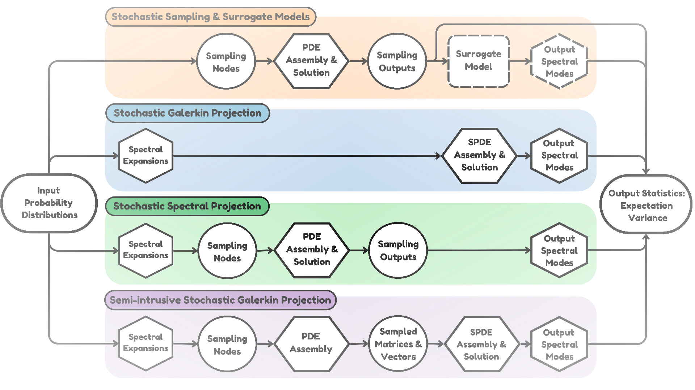

<b>Figure:</b> (1), (3), (4) are the easy to implement sampling-based methods for the propagation of uncertainties through computational physics frameworks.

---

#### Parallel Finite Element Framework for Rotorcraft Multibody Dynamics and Adjoint Sensitivities

> ##### AIAA Journal; Volume 57; Number 8; 2019
>
> ##### Appeared in the Special Issue on Sensitivity Analysis for Rotorcraft Optimization
>
> ##### DOI https://doi.org/10.2514/1.J056585
>
> ##### Komahan Boopathy and Graeme. J. Kennedy

[Preprint](assets/2019-rotorcraft-adjoint-optimization-preprint.pdf)

##### Summary

A parallel finite-element framework for high-fidelity structural dynamic analysis and discrete gradient evaluation using the adjoint method is presented. The framework is intended to be used for gradient-based design optimization of flexible multibody dynamic systems such as rotorcraft. The formulation of governing equations, numerical treatment of kinematic constraints, and the evaluation of functionals of interest and their derivatives are addressed. A minimal set of routines needed to implement the discrete adjoint method are proposed. The governing equations are integrated in time using a diagonally implicit Runge–Kutta method for second-order systems of equations. The formulation of the corresponding time-dependent discrete adjoint method is presented and is numerically verified using the complex-step method. A verification of the dynamics, an assessment of parallel scalability of the analysis and derivative evaluation techniques, and a demonstration of the design capability are presented.  

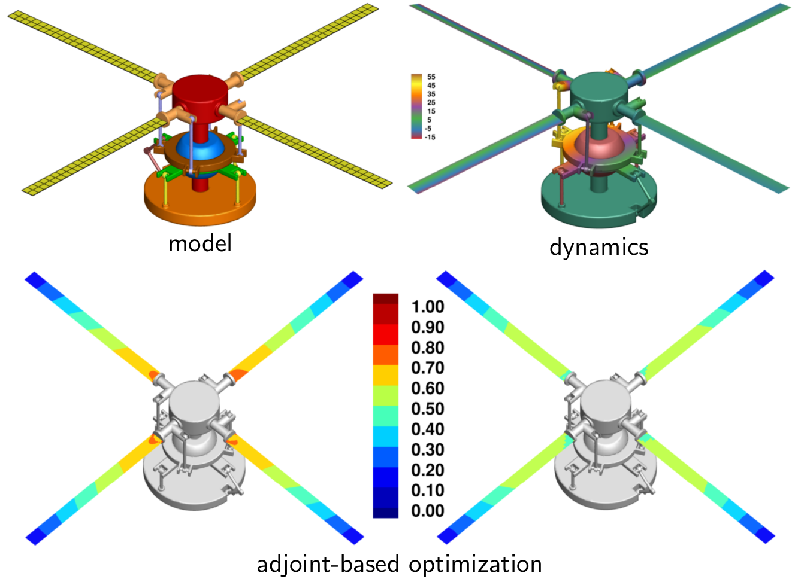

<b>Figure: </b> A model helicopter hub assembly is improved by optimally distributing the blade thickness using the adjoint-based optimization methodology.

The hub model parameters for this article were mostly adapted from [The HART-II Test: Rotor Wakes and Aeroacoustics with Higher-Harmonic Pitch Control (HHC) Inputs - The Joint German/French/Dutch/US Project (nasa.gov)](https://rotorcraft.arc.nasa.gov/Publications/files/Yu_AHSF02.pdf)

---

#### Unified Framework for Training Point Selection and Error Estimation for Surrogate Models

> ##### AIAA Journal; Volume 53; Number 1; 2015
>
> ##### DOI https://doi.org/10.2514/1.J053064
>
> ##### Komahan Boopathy and Markus P. Rumpfkeil

[Preprint](assets/2015-surrogate-dynamic-preprint.pdf)

##### Summary

A unified framework for surrogate model training point selection and error estimation is proposed. Building auxiliary local surrogate models over subdomains of the global surrogate model forms the basis of the proposed  framework. A discrepancy function, defined as the absolute difference between response predictions from local and global surrogate models for randomly chosen test candidates, drives the framework, thereby not requiring any additional exact function evaluations. The benefits of this new approach are demonstrated with analytical test functions and the construction of a two-dimensional aerodynamic database. The results show that the proposed training point selection approach improves the convergence monotonicity and produces more accurate surrogate models compared to random and quasi-random training point selection strategies. The introduced root-mean-square discrepancy and maximum absolute discrepancy exhibit close agreement with the actual root-mean-square error and maximum absolute error, respectively, and are therefore proposed as a measure for the approximation accuracy of surrogate models in applications of practical interest. Multivariate interpolation and regression is employed to build local surrogates, whereas kriging and polynomial chaos expansions serve as global surrogate models in demonstrating the applicability of the proposed framework. 

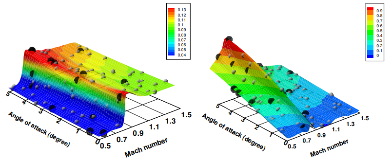

<b>Figure:</b> The Kriging surrogate model of lift coefficient built using the developed method for adaptive training point selection for high-fidelity training data and random selection for low-fidelity training data.

### (II) Conference Papers

#### Semi-Intrusive Uncertainty Propagation and Adjoint Sensitivity Analysis Using the Stochastic Galerkin Method

> ##### 22nd AIAA Non-Deterministic Approaches Conference, Orlando, Florida, Jan 2020
>
> ##### [AIAA Paper 2020-1146](https://arc.aiaa.org/doi/10.2514/6.2020-1146)
>
> ##### DOI https://arc.aiaa.org/doi/10.2514/6.2020-1146
>
> ##### Komahan Boopathy and Graeme. J. Kennedy

[Paper](assets/2020-semi-intrusive-adjoint-paper.pdf)

##### Summary

Stochastic Galerkin projection techniques provide an efficient method to propagate uncertainties through simulations governed by differential equations. However, stochastic Galerkin methods are often challenging to implement within existing deterministic finite-element libraries and may require extensive source code modifications. In this work, we present a semi-intrusive stochastic Galerkin methodology that fully reuses existing deterministic finite-element implementations to perform projection in the probabilistic domain. Furthermore, the proposed semi-intrusive technique enables the use of deterministic derivatives for the adjoint method, yielding a stochastic Galerkin adjoint without further implementation effort. The principal idea is to project the deterministic element residuals, Jacobians, boundary conditions, and adjoint terms on to the probabilistic space prior to assembly of the stochastic finite element system, assuming the deterministic implementations to be black-box. The deterministic implementations must support the ability to update random parameters to enable quadrature in the stochastic space. The proposed semi-intrusive stochastic Galerkin approach is demonstrated using TACS, a finite-element framework with a adjoint-based gradient evaluation methods. The capabilities are demonstrated on several test problems including a flexible multibody dynamics simulation of a four bar mechanism.

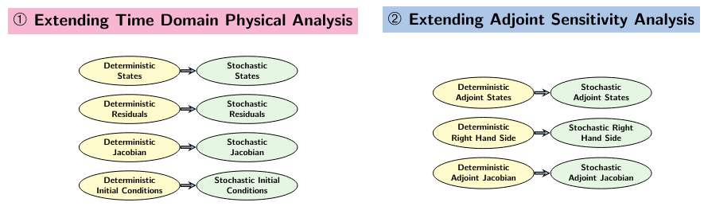

<b>Figure:</b> The applied conceptual framework for a probablistic sampling based stochastic Galerkin implementation.

---

#### Adjoint-based derivative evaluation methods for flexible multibody systems with rotorcraft applications

> ##### 55th AIAA Aerospace Sciences Meeting, Grapevine, Texas, Jan 2017
>
> ##### Special Session on Sensitivity Analysis of High-Fidelity Rotorcraft Computations
>
> ##### [AIAA Paper 2017-1671](https://arc.aiaa.org/doi/10.2514/6.2017-1671)
>
> ##### DOI https://arc.aiaa.org/doi/10.2514/6.2017-1671
>
> ##### Komahan Boopathy and Graeme. J. Kennedy

[Paper](assets/2017-scitech-rotor-adjoint-paper.pdf)

##### Summary

High-fidelity rotorcraft simulations involve tight coupling between aerodynamics, structures and structural dynamics. As a step towards developing fully-integrated high-fidelity rotorcraft simulation and gradient-based design optimization tool, this paper presents analysis and discrete-adjoint sensitivity formulations for flexible multibody systems. The governing equations are treated in a descriptor form, as second-order implicit functions of state and design variables. The solution procedures for the governing equations are discussed in the context of different time marching schemes, including backward difference formulas, diagonally implicit Runge–Kutta, Newmark and Adams–Bashforth–Moulton methods. The corresponding time-dependent discrete adjoint derivatives are formulated and numerically verified with the complex-step method. The assessments of parallel scalability of the implementation are shown along with flexible multibody dynamics applications of the framework.

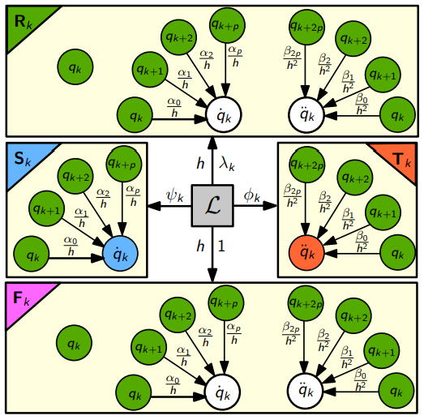

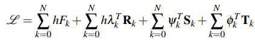

<b>Figure:</b> The discrete adjoint Lagrangian of the backward differences methodology for the integration of second-order differential equations in time. The stationary points of the Lagrangian are the adjoint system of equations in time.

---

#### A Scalable Adjoint Method for Coupled Flexible Multibody Dynamics

> ##### 57th AIAA/ASCE/AHS/ASC Structures, Structural Dynamics, and Materials Conference, San Diego, California, Jan 2016
>
> ##### [AIAA Paper 2016-1907](https://dx.doi.org/10.2514/6.2016-1907)
>
> ##### DOI https://dx.doi.org/10.2514/6.2016-1907
>
> ##### Graeme J. Kennedy and Komahan Boopathy

[PDF](assets/2016-multibody-dynamics-adjoint-paper.pdf)

##### Summary

High-performance aerospace structures are light-weight, flexible, frequently made from multiple, connected components, and are subject to dynamic loads. To design structures subject to these conditions, we propose a scalable adjoint method for coupled flexible multibody dynamic simulations. Adjoint-based derivative evaluation methods have been used for design optimization in a wide-array of multidisciplinary applications. However, relatively few authors have developed adjoint methods for flexible multibody dynamic simulations. To address this issue, we develop a modular adjoint-based derivative evaluation method for flexible multibody systems that is designed for high-performance parallel computing environments. We envision that this framework will be useful for the assessment and design of flexible multibody systems that arise in many aerospace applications.

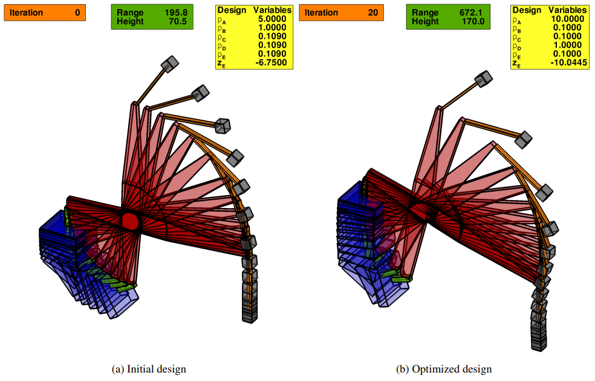

<b>Figure:</b> Adjoint based solution of range maximization of a projectile in the subject to the physics of coupled multibody dynamics. 

---

#### Robust Optimization of a Wing Under Structural and Material Uncertainties

> ##### 17th AIAA Non-Deterministic Approaches Conference, Kissimmee, Florida, Jan 2015
>
> ##### [AIAA Paper 2015-0920](https://arc.aiaa.org/doi/abs/10.2514/6.2015-0920)
>
> ##### DOI https://arc.aiaa.org/doi/abs/10.2514/6.2015-0920
>
> ##### Komahan Boopathy, Markus P. Rumpfkeil, and Raymond. M. Kolonay

##### Summary

[PDF](assets/2015-surrogate-robopt-wing-sizing-paper.pdf)

This paper demonstrates structural sizing optimizations of a fighter wing configuration in the presence of uncertainties in structural parameters and material properties. The design variables and input parameters are considered to have uncertainties and are treated as aleatory and epistemic random variables in the optimization process. The aleatory uncertainties are quantified and propagated via inexpensive sampling of kriging surrogate models, whereas the epistemic uncertainties are propagated using a box-constrained optimization approach. The considered loading condition arises from trimmed flight at a 220 degree roll maneuver. The resulting designs are shown to be robust against input anomalies to desired probabilistic levels. 

<b>Figure:</b> A surrogate-model based robust optimization on a model representative of a figher jet in 220 degrees per second roll maneuver at a speed of mach 0.7. The geometrical parameters of the spars, spar caps, ribs, skins and, connection rods are subject to design sizing optimization methodology. The produced deterministic design is shown on the left and the robust design is shown on the right. The robust wing undergoes lesser deformations under operational loading. 
 

---

#### Robust Optimizations of Structural and Aerodynamic Designs

> ##### 15th AIAA/ISSMO Multidisciplinary Analysis and Optimization Conference, Atlanta, Georgia, June 2014
>
> #### [AIAA Paper 2014-2595](https://arc.aiaa.org/doi/abs/10.2514/6.2014-2595)
>
> ##### DOI https://arc.aiaa.org/doi/abs/10.2514/6.2014-2595
>
> ##### Komahan Boopathy and Markus P. Rumpfkeil

[PDF](assets/2014-surrogate-robust-airfoil-shape-paper.pdf)

##### Summary

This paper demonstrates the use of polynomial chaos and kriging surrogate models, which are enhanced with a dynamic training point selection framework, for the propagation of mixed epistemic and aleatory uncertainties in robust optimization problems. The selection of training points for the two surrogate models is guided by local surrogate models (multivariate interpolation and regression) which are built using a subset of the available training data. The aleatory uncertainties are propagated via extensive sampling of the surrogate models, whereas the epistemic uncertainties are propagated using a box-constrained optimization approach. Robust optimizations are demonstrated for two structural and one aerodynamic test problem. The structural test cases include designing a three-bar truss and a cantilever beam, whereas the aerodynamic test case involves the robust lift-constrained drag minimization of an airfoil under transonic flow conditions.

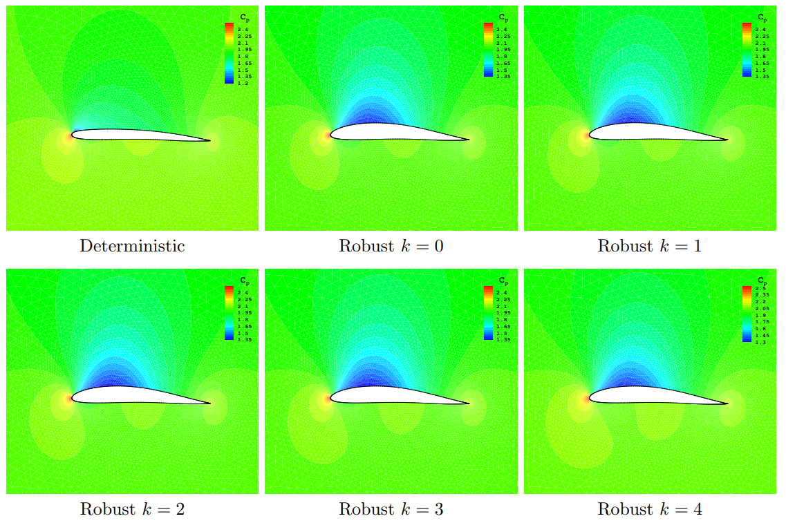

<b>Figure:</b> The optimized airfoil shapes produced using the developed optimization under uncertainty framework, shows improvement in lift distribution qualities in comparison to the deterministic design. 

---

#### A Multivariate Interpolation and Regression Enhanced Kriging Surrogate Model

> ##### 21st AIAA Computational Fluid Dynamics Conference, San Diego, California, June 2013
>
> ##### [AIAA Paper 2013-2964](https://arc.aiaa.org/doi/abs/10.2514/6.2013-2964)
>
> ##### DOI https://arc.aiaa.org/doi/abs/10.2514/6.2013-2964
>
> ##### Komahan Boopathy and Markus P. Rumpfkeil

[PDF](assets/2013-kriging-mir-dynamic-paper.pdf)

##### Summary

We present a Kriging surrogate model that is enhanced with a Multivariate Interpolation and Regression (MIR) through a dynamic training point selection. We propose an adaptive training point selection strategy where MIR is used as a local surrogate model that guides the construction of the global Kriging surrogate model. The quality of the resulting MIR enhanced Kriging surrogate model is demonstrated for two-, five- and nine-dimensional analytic test functions. The results indicate that the model performs better than currently available Kriging surrogates as well as a previously enhanced Kriging surrogate that uses Dutch Intrapolation as a local surrogate model. Preliminary results of using variable-fidelity data in the construction of the MIR enhanced Kriging surrogate model are also presented and show promise.  

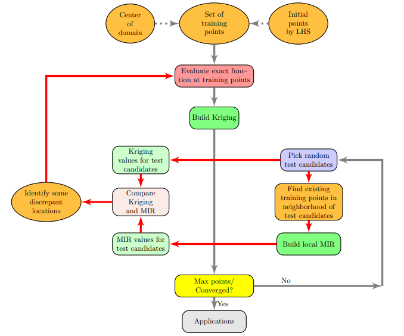

<b>Figure:</b> The proposed adaptive framework for training point selection.

---

#### Building Aerodynamic Databases Using Enhanced Kriging Surrogate Models

> ##### AIAA Region III Student Conference, Chicago, Illinois, April 2013
>
> ##### Komahan Boopathy and Markus P. Rumpfkeil

[PDF](assets/2013-chicago-kriging-paper.pdf)

##### Summary

Recently, we developed a variable-fidelity hybrid Kriging surrogate model1 that is enhanced by Multivariate Interpolation and Regression (MIR) and adaptive training point selection. We use MIR as a local surrogate model that guides the construction of the global Kriging surrogate. The adaptive training point strategy that we use adds training points at locations where the difference between local (MIR) and global (Kriging) surrogate predictions differ by a given threshold. The model is iteratively updated at these locations of greater uncertainty until convergence or a maximum number of evaluations has been reached. This approach helps us to monitor the progress of the surrogate model construction as well as eliminates unnecessary function evaluations in regions where the surrogate is already doing a good job approximating the exact function. In this paper, we demonstrate the use of our hybrid Kriging model for the construction of a two-dimensional aerodynamic database for a NACA 0012 airfoil in steady and inviscid transonic flow. We study the variations of its lift and drag coefficients for changes in Mach number (0.5 < M < 1.5) and angle of attack (0 ◦ < α < 5 ◦ ). For the purpose of validation of our hybrid surrogate, an “exact” database is obtained through Euler flow solves on a Cartesian mesh of 51×51 = 2601 equispaced nodes. The root mean square error (RMSE) between the exact and surrogate approximated coefficient values over the entire domain are calculated and used to compare the performances of ordinary Kriging approaches and our enhanced Kriging approach. We also investigate the use of variable-fidelity training points to build the surrogate even more efficiently.

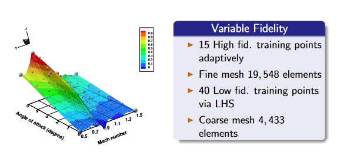

<b>Figure:</b> The Kriging surrogate model of the lift coefficient is built using high and low fidelity training points. 

### Theses

#### Adjoint Based Design Optimization of Systems with Time Dependent Physics and Probabilistically Modeled Uncertainties

> ##### Ph.D. Dissertation
>
> ##### School of Aerospace Engineering, Georgia Institute of Technology, Atlanta, Georgia, 2020
>
> ##### Komahan Boopathy
>
> ##### DOI http://hdl.handle.net/1853/63658

[PDF](assets/2020-komahan-boopathy-gatech-phd-thesis.pdf) 

[Slides](assets/2020-komahan-boopathy-gatech-phd-thesis-talk.pdf)

##### Summary

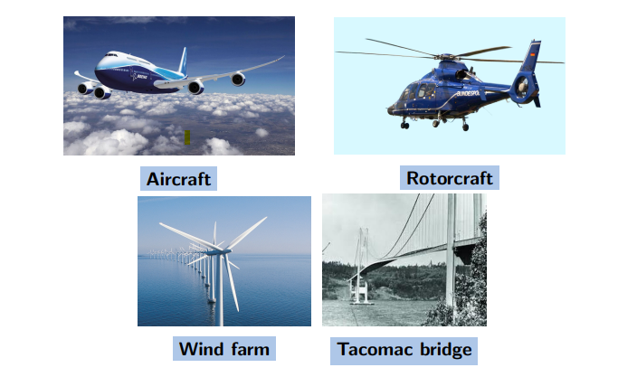

<b>Figure:</b> Time dependent physics in aerospace and civil engineering applications. 

For aerospace structures, failure can occur not only because of static adversities like divergence, but also due to time dependent issues like flutter and large vibrations. Therefore, the consideration of time-domain physics becomes essential during design. The physics-based design of aerospace systems involves solving partial differential equations to obtain metrics of interest that guide the design process. These differential equations contain unknown parameters that are sometimes difficult to be characterized as a deterministic value. The uncertainties in input parameters have a direct impact on the output metrics of interest which guide the system design process. To this end, optimization under uncertainty has evolved as a field that accounts for the effect of uncertainties, by propagating the effect of uncertainties through physics simulations. 

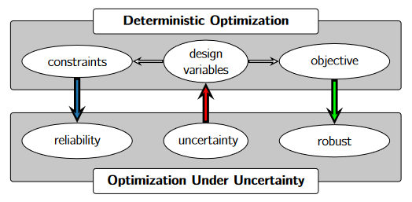

<b>Figure:</b> The evolution of optimization under uncertainty from deterministic optimization. 

For numerical optimization, the algorithms that do not use gradient information become computationally intractable as the number of design variables increases. Moreover, the numerical approximations of the gradients through the finite-difference or the complex-step methods are inefficient, for their lack of scalability with respect to the number of design variables. Therefore, efficient gradient evaluation techniques such as the adjoint method are needed for solving large scale optimization problems with practical turnaround times. However, because of the inclusion of time dependent physics, the corresponding time dependent adjoint equations needs to be formulated and implemented. Furthermore, the uncertainties need to be propagated through the time dependent physics and the adjoint sensitivity analysis framework. Due to the inherent complexities in the development of time domain physics and adjoint sensitivities analysis capabilities, the sampling-based methods are widely used for the propagation of uncertainties while the projection-based methods are less used. 

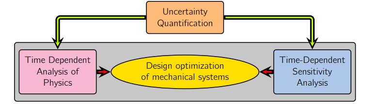

<b>Figure:</b> The propagation of uncertainties through physics and adjoint frameworks.

This work presents enhanced implicit time marching methods for flexible multibody dynamics, to analyze the time dependent behavior of aerospace structures, and formulates the corresponding time dependent adjoint sensitivity analysis equations, to efficiently optimize designs using gradient based methods. The adjoint-based design capabilities are demonstrated with the structural optimization of a rotorcraft hub system. 

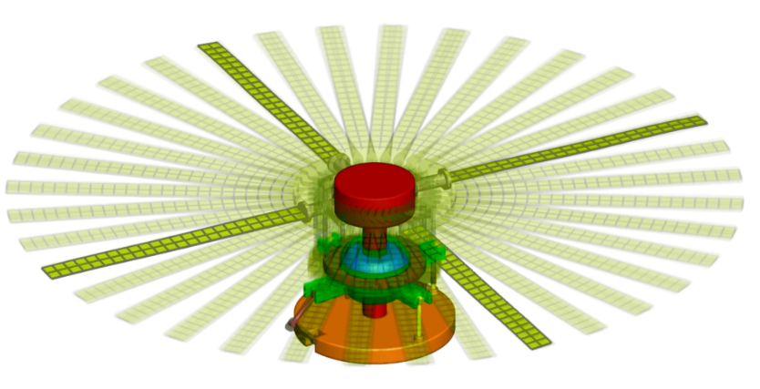

<b>Figure:</b> The rotocraft model subject to adjoint based optimization.

A newly developed semi-intrusive approach for projection is shown to fully reuse the underlying time-domain analysis and adjoint sensitivity analysis capabilities, for the projection-based propagation of uncertainties. Using this method, the stochastic residuals and Jacobians are formed implicitly from the deterministic counterparts that have been implemented apriori. 

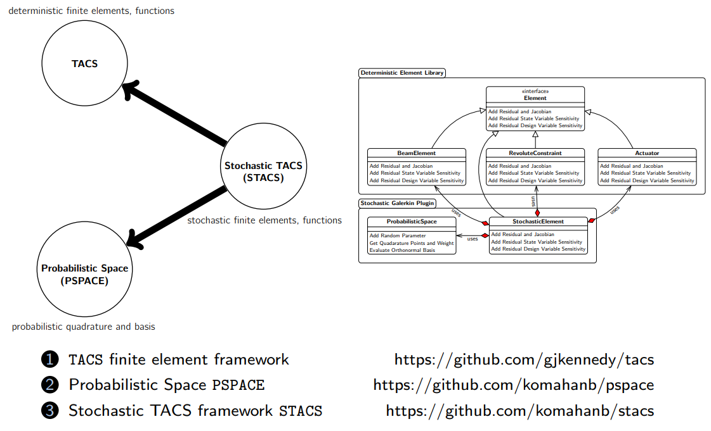

<b>Computational Framework for UQ-OUU :</b> Open Source Packages.

The application of the semi-intrusive projection method is shown using a flexible robotic manipulator system modeled after the Canadarm. In the presence of uncertainties in the payloads, the Canadarm system experiences stresses that have a large variability. This work demonstrates the use of uncertainty quantification as a valuable tool for assessing the risk associated with such operating conditions.  

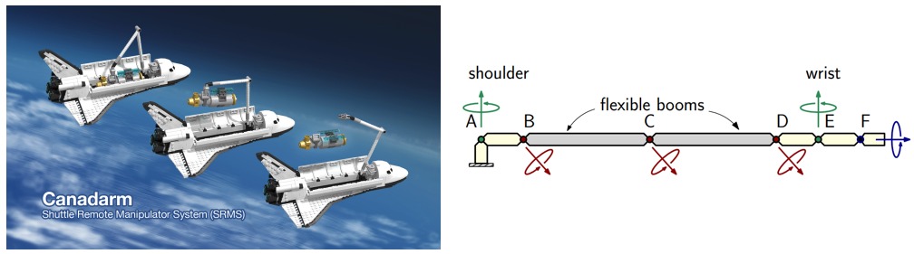

<b>Figure:</b> The Canadarm system and its simplified finite element model used for optimization under uncertainty.

---

#### Uncertainty Quantification and Optimization Under Uncertainty Using Surrogate Models

> ##### Masters Thesis
>
> ##### Department of Mechanical and Aerospace Engineering, University of Dayton, Dayton, Ohio, 2014
>
> ##### DOI http://rave.ohiolink.edu/etdc/view?acc_num=dayton1398302731
>
> ##### Komahan Boopathy

[PDF](assets/2014-komahan-boopathy-masters-thesis.pdf)

[Slides](assets/2014-komahan-boopathy-masters-thesis-talk.png)

##### Summary

Surrogate models are widely used as approximations to exact functions that are computationally expensive to evaluate. The choice of model training information and the estimation of the accuracy of surrogate models are major research avenues. In this work, a unified dynamic framework for surrogate model training point selection and error estimation is proposed. Building auxiliary local surrogate models over sub-domains of the global surrogate model forms the basis of the framework. A discrepancy function, defined as the absolute difference between response predictions from global and local surrogate models for randomly chosen test candidates, drives the framework.

The framework preferably evaluates the expensive exact function at locations, where the value of the discrepancy function is high and when a distance-constraint to previously existing training points are satisfied. As a result, the surrogate model is continually refined in regions of higher uncertainty in prediction, and a better spread of training points is also achieved. Unlike most training point selection approaches, the framework addresses surrogate training from two disparate contexts, as training in the presence and absence of derivative information. The local surrogate models use the derivative information when available and affect the framework via the discrepancy function, and helps determine the locations that require derivative information. The benefits of the dynamic training approach are demonstrated with analytical test functions and the construction of a two-dimensional aerodynamic database. The results show that the proposed method improves the convergence monotonicity and produces more accurate surrogate models, when compared to random and quasi-random training point selection strategies.

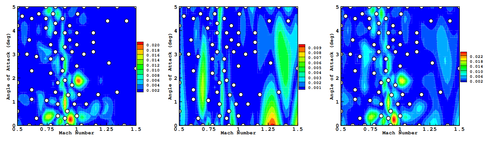

<b>Figure:</b>The local surrogate model has orders of magnitude higher errors (left) in aerodynamic drag prediction than the main surrogate model error (middle), yet the difference between the two (right) effectively guides the training point selection process by systematically placing training points from the transonic regime of physics with higher nonlinearity in the parameter space.

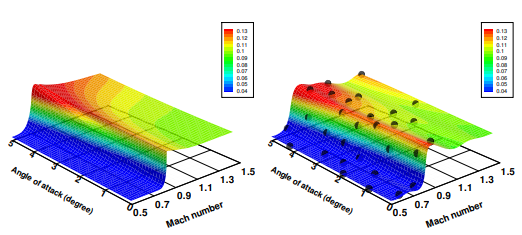

<b>Figure:</b>The exact drag function (left) and the approximated drag function (right) contructed using a few training points selected dynamically.

The newly introduced discrepancy function is proposed as an approximation to the actual error in the prediction of the surrogate model leading to the quantities: root mean square discrepancy (RMSD) and maximum absolute discrepancy (MAD). The results demonstrate a close agreement of RMSD and MAE with the actual root mean square error (RMSE) and maximum absolute error (MAE), respectively. Therefore, RMSD and MAD are proposed as measures for the accuracy of the surrogate models in applications of practical interest. The benefit of surrogate validation comes without warranting any additional exact function evaluations, which makes the framework computationally viable.

Multivariate interpolation and regression model is employed to build local surrogates, whereas the kriging and polynomial chaos expansions serve as global surrogate models. This demonstrates the applicability of the proposed framework to any surrogate model with an open choice of training data selection.

Finally, the dynamically trained surrogate models are applied to uncertainty quantifications and optimizations under mixed epistemic and aleatory uncertainties (OUU), for structural and aerodynamic test cases. In the OUUs epistemic uncertainties are propagated via box-constrained optimizations, whereas the aleatory uncertainties are propagated via inexpensive sampling of the surrogate models. The structural test cases include designing a three-bar truss and a cantilever beam, whereas the aerodynamic test case involves the robust optimization (lift-constrained drag minimization) of an airfoil under steady flow conditions.  

<b>Figure:</b> The optimized airfoil shapes produced using the developed optimization under uncertainty framework, shows improvement in lift distribution qualities in comparison to the deterministic design. 
